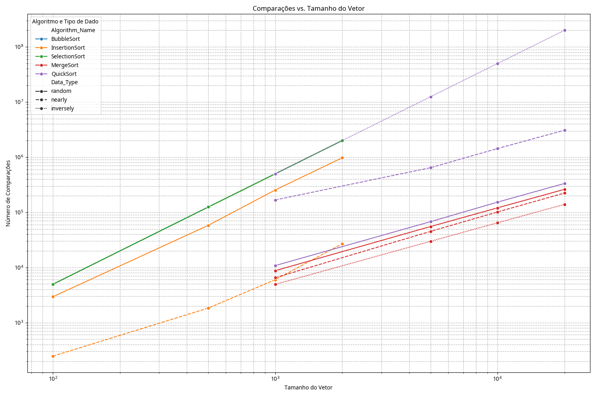
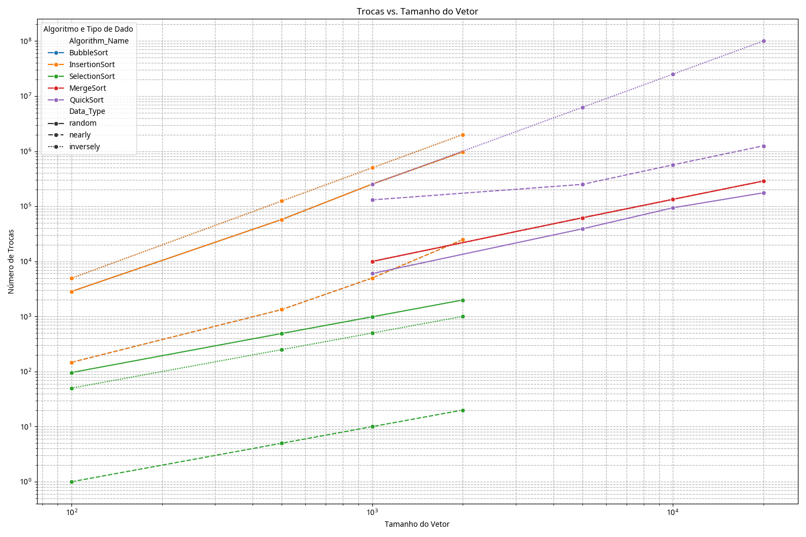

# Atividade Prática Unidade II: Análise Comparativa de Algoritmos de Ordenação

#Turma: IMD0029
#Aluno: Pedro Henrique de Araujo Alves
#Matrícula: 20230090820 

## 1. Introdução

Aprensentação da análise comparativa de cinco algoritmos de ordenação, sendo eles BubbleSort, InsertionSort, SelectionSort, MergeSort e QuickSort. O objetivo principal deste trabalho é uma breve contextualização sobre a importância dos algoritmos de
ordenação em diferentes cenários de dados (random, aproximadamente ordenados e inversamente ordenados) para diversos tamanhos de entrada. Além disso, através da medição do tempo de execução, número de comparações e número de trocas, mostrará as complexidades teóricas conhecidas e identificar as aplicações mais adequadas para cada algoritmo

## 2. Algoritmos de ordenacao
Uma breve apresentação dos cinco algoritmos de ordenação analisados com suas complexidades teóricas de tempo e espaço

### 2.1. BubbleSort

O Bubble Sort é um algoritmo de ordenação simples, baseado na ideia de repetidamente
comparar pares de elementos adjacentes e trocar de posição se estiverem fora de ordem. A
cada passagem pelo vetor, o maior elemento “flutua” para o final da lista.

*   **Complexidade:**
    *   **Melhor Caso:** O(n) - quando o array já está ordenado. O algoritmo ainda percorre o array, mas não realiza trocas.
    *   **Pior Caso:** O(n²) - quando o array está inversamente ordenado. Cada elemento precisa ser movido para sua posição correta através de múltiplas passagens.
    *   **Caso Médio:** O(n²) - o desempenho médio é similar ao pior caso devido ao grande número de comparações e trocas necessárias.
  
### 2.2. InsertionSort

O InsertionSort é um algoritmo de ordenação simples e intuitivo. Baseado na ideia de construir constrói a matriz final ordenada um item por vez. 

*   **Complexidade:**
    *   **Melhor Caso:** O(n) - quando o array já está ordenado. O algoritmo faz apenas uma passagem, comparando cada elemento com o último elemento da parte ordenada.
    *   **Pior Caso:** O(n²) - quando o array está inversamente ordenado. Cada elemento precisa ser comparado e movido através de toda a parte ordenada.
    *   **Caso Médio:** O(n²) - o desempenho médio é similar ao pior caso.

### 2.3. SelectionSort

*O Selection Sort é um algoritmo de ordenação onde Dado um vetor de entrada v[N]
*○ Selecione o primeir menor elemento e coloque-o na primeira posição
*○ Selecione o segundo menor elemento e coloque-o na segunda posição
* …
*○ Selecione o N-ésimo menor elemento e coloque-o na N-ésima posição 

*   **Complexidade:**
    *   **Melhor Caso:** O(n²) - o número de comparações e trocas é sempre o mesmo, independentemente do estado inicial do array.
    *   **Pior Caso:** O(n²) - o número de comparações e trocas é sempre o mesmo.
    *   **Caso Médio:** O(n²) - o desempenho médio é sempre o mesmo.
      
### 2.4. Merge Sort

O Merge Sort é um algoritmo de ordenação eficiente, baseado na estratégia de dividir e conquistar. Ele divide recursivamente o array em duas metades até que cada sub-array contenha apenas um elemento (que é considerado ordenado). Em seguida, ele mescla (merge) essas sub-arrays de forma ordenada para produzir arrays maiores e ordenados.

*   **Complexidade de Tempo:**
    *   **Melhor Caso:** O(n log n) - o número de divisões e mesclagens é sempre o mesmo.
    *   **Pior Caso:** O(n log n) - o número de divisões e mesclagens é sempre o mesmo.
    *   **Caso Médio:** O(n log n) - o desempenho médio é sempre o mesmo.
*   **Complexidade de Espaço:** O(n) - requer espaço auxiliar para armazenar as sub-arrays durante o processo de mesclagem.

### 2.5. Quick Sort

O Quick Sort é um algoritmo de ordenação eficiente, também baseado na estratégia de dividir e conquistar. Ele seleciona um elemento como 'pivô' e particiona o array em torno do pivô, de modo que todos os elementos menores que o pivô fiquem antes dele e todos os elementos maiores fiquem depois. O processo é então aplicado recursivamente às sub-arrays resultantes.

*   **Complexidade de Tempo:**
    *   **Melhor Caso:** O(n log n) - quando o pivô divide o array em duas partes aproximadamente iguais.
    *   **Pior Caso:** O(n²) - quando o pivô escolhido é sempre o menor ou o maior elemento, resultando em partições desequilibradas.
    *   **Caso Médio:** O(n log n) - o desempenho médio é muito bom na prática.
*   **Complexidade de Espaço:** O(log n) - devido à recursão da pilha de chamadas, embora possa ser O(n) no pior caso (pivô desequilibrado).

## 3. Metodologia

Para realizar a análise comparativa dos algoritmos de ordenação, foi desenvolvida uma metodologia experimental rigorosa, focada na coleta de métricas de desempenho em diferentes condições de entrada. As métricas coletadas foram tempo de execução, número de comparações e número de trocas (ou movimentos de dados, no caso do Merge Sort e Insertion Sort).

### 3.1. Geração de Dados

Foram utilizados três tipos de conjuntos de dados para testar os algoritmos, a fim de simular diferentes cenários de aplicação e observar o impacto na performance:

*   **Aleatórios (Random):** Vetores preenchidos com números inteiros gerados aleatoriamente. Este tipo de dado representa o caso mais comum e imprevisível.
*   **Quase Ordenados (Nearly Sorted):** Vetores que já estão majoritariamente ordenados, com uma pequena porcentagem de elementos fora de ordem. Este cenário é comum em bases de dados que são frequentemente atualizadas e reordenadas.
*   **Inversamente Ordenados (Inversely Sorted):** Vetores onde os elementos estão em ordem decrescente. Este é tipicamente o pior caso para muitos algoritmos de ordenação, especialmente os de complexidade O(n²).

Os dados foram gerados utilizando uma biblioteca auxiliar em C++ (`data_generator.hpp`), garantindo a consistência e reprodutibilidade dos testes.

### 3.2. Tamanhos dos Vetores Testados

Para avaliar o escalonamento dos algoritmos, foram definidos diferentes tamanhos de vetores para os testes. Observou-se que algoritmos de complexidade O(n²) (Bubble Sort, Insertion Sort, Selection Sort) tornam-se proibitivamente lentos para grandes entradas. Assim, foram utilizados dois conjuntos de tamanhos:

*   **Pequenos Tamanhos (para algoritmos O(n²)):** 100, 500, 1000, 2000 elementos.
*   **Grandes Tamanhos (para algoritmos O(n log n)):** 1000, 5000, 10000, 20000 elementos.

Essa distinção permitiu uma análise mais detalhada do comportamento de cada algoritmo dentro de sua faixa de aplicabilidade prática.

### 3.3. Métricas Coletadas e Método de Medição

As seguintes métricas foram coletadas para cada execução de algoritmo:

*   **Tempo de Execução (Time_ms):** Medido em milissegundos, utilizando a biblioteca `chrono` do C++. O tempo foi capturado do início ao fim da execução da função de ordenação.
*   **Comparações (Comparisons):** O número total de vezes que dois elementos foram comparados durante o processo de ordenação. Esta métrica é crucial para entender a eficiência teórica do algoritmo.
*   **Trocas (Swaps):** O número total de vezes que dois elementos foram trocados de posição no vetor. Para algoritmos como o Insertion Sort e Merge Sort, que realizam movimentos de dados em vez de trocas diretas, esta métrica representa o número de movimentos de elementos.

Cada algoritmo foi executado para cada combinação de tipo de dado e tamanho de vetor. Os resultados foram registrados em um arquivo CSV (`sorting_metrics.csv`) para posterior análise e geração de gráficos. A instrumentação para coleta de comparações e trocas foi adicionada diretamente nas implementações dos algoritmos para garantir precisão.

## 4. Resultados e Análise

Nesta seção, apresentamos os resultados obtidos a partir dos testes experimentais, seguidos de uma análise crítica do desempenho de cada algoritmo em diferentes cenários. Os dados brutos foram processados para gerar tabelas comparativas e gráficos que ilustram as relações entre tempo de execução, número de comparações, número de trocas e o tamanho do vetor.

### 4.1. Tabelas Comparativas

Abaixo, apresentamos uma tabela resumida das métricas médias coletadas para cada algoritmo e tipo de dado. Esta tabela oferece uma visão geral do desempenho, permitindo comparações rápidas entre os algoritmos.

# Tabela Comparativa de Métricas Médias

| Algorithm_Name   | Data_Type   |    Time_ms |      Comparisons |            Swaps |
|:-----------------|:------------|-----------:|-----------------:|-----------------:|
| BubbleSort       | inversely   |  11.3696   | 657050           | 657050           |
| BubbleSort       | nearly      |   3.86085  | 657050           |   7810           |
| BubbleSort       | random      |  10.2423   | 657050           | 321374           |
| InsertionSort    | inversely   |   5.40978  | 657050           | 657050           |
| InsertionSort    | nearly      |   0.072989 |   8709           |   7810           |
| InsertionSort    | random      |   2.67519  | 322268           | 321374           |
| MergeSort        | inversely   |   5.10109  |  59640           | 123158           |
| MergeSort        | nearly      |   5.18527  |  94116.2         | 123158           |
| MergeSort        | random      |   6.08751  | 111329           | 123158           |
| QuickSort        | inversely   | 659.048    |      6.57455e+07 |      3.28795e+07 |
| QuickSort        | nearly      |  12.0049   |      1.3319e+06  | 549120           |
| QuickSort        | random      |   2.3062   | 141243           |  78579.8         |
| SelectionSort    | inversely   |   3.5595   | 657050           |    450           |
| SelectionSort    | nearly      |   3.47837  | 657050           |      9           |
| SelectionSort    | random      |   3.55828  | 657050           |    890.75        |

### 4.2. Análise Gráfica

Os gráficos gerados (Tempo de Execução vs. Tamanho do Vetor, Comparações vs. Tamanho do Vetor, Trocas vs. Tamanho do Vetor) fornecem uma representação visual clara do comportamento dos algoritmos. As escalas logarítmicas nos eixos permitem observar o crescimento das métricas em uma ampla gama de tamanhos de entrada.

#### 4.2.1. Tempo de Execução vs. Tamanho do Vetor

Observa-se claramente a distinção entre os algoritmos de complexidade O(n²) (Bubble Sort, Insertion Sort, Selection Sort) e O(n log n) (Merge Sort, Quick Sort). Para tamanhos de vetor menores, a diferença de tempo pode não ser tão acentuada, mas à medida que o tamanho do vetor aumenta, os algoritmos O(n log n) demonstram um desempenho significativamente superior. O Quick Sort, em particular, mostra um excelente desempenho para dados aleatórios e quase ordenados, mas seu tempo de execução dispara para dados inversamente ordenados, confirmando seu pior caso O(n²).

#### 4.2.2. Comparações vs. Tamanho do Vetor

O número de comparações é uma métrica fundamental para a eficiência de um algoritmo de ordenação. Os algoritmos O(n²) (Bubble Sort, Insertion Sort, Selection Sort) mostram um crescimento quadrático no número de comparações, como esperado. O Insertion Sort para dados quase ordenados apresenta um número de comparações muito menor, o que valida sua eficiência em cenários onde os dados já estão parcialmente ordenados. Os algoritmos O(n log n) (Merge Sort, Quick Sort) mantêm um número de comparações muito mais baixo e com um crescimento mais suave, refletindo sua superioridade para grandes volumes de dados.

#### 4.2.3. Trocas vs. Tamanho do Vetor

O número de trocas (ou movimentos de dados) é um indicador do custo de movimentação de elementos na memória. O Bubble Sort e o Insertion Sort (para dados inversamente ordenados) apresentam um alto número de trocas, o que contribui para seu desempenho inferior. O Selection Sort, embora tenha um número de comparações O(n²), realiza um número significativamente menor de trocas, o que pode ser uma vantagem em cenários onde a operação de troca é muito custosa. O Merge Sort, por sua natureza, realiza um número elevado de movimentos de dados (contabilizados como trocas aqui), devido à necessidade de arrays auxiliares. O Quick Sort, por sua vez, apresenta um número de trocas que varia consideravelmente com o tipo de dado, sendo mais eficiente em dados aleatórios.

### 4.3. Discussão Crítica

Os resultados experimentais corroboram em grande parte as complexidades teóricas dos algoritmos. Os algoritmos de complexidade quadrática (Bubble, Insertion, Selection) são adequados apenas para conjuntos de dados muito pequenos ou para cenários específicos (como Insertion Sort para dados quase ordenados). Para grandes volumes de dados, os algoritmos O(n log n) (Merge Sort, Quick Sort) são indispensáveis.

O Quick Sort se destaca pela sua velocidade na maioria dos casos, especialmente com dados aleatórios, mas sua performance degrada drasticamente no pior caso (dados inversamente ordenados), o que o torna menos previsível. O Merge Sort, por outro lado, mantém um desempenho consistente de O(n log n) em todos os cenários, tornando-o uma escolha robusta quando a estabilidade e a previsibilidade são cruciais, apesar de seu maior consumo de memória. O Selection Sort, apesar de ser O(n²), tem a vantagem de realizar o menor número de trocas, o que pode ser relevante em contextos específicos.

## 5. Conclusões

Este estudo comparativo dos algoritmos de ordenação Bubble Sort, Insertion Sort, Selection Sort, Merge Sort e Quick Sort reforça a importância de compreender as características de desempenho de cada um, tanto teóricas quanto práticas. Os resultados experimentais confirmaram as complexidades de tempo e espaço esperadas para cada algoritmo, bem como suas sensibilidades a diferentes tipos de dados de entrada.

Em resumo, podemos estabelecer o seguinte ranking de desempenho e aplicações recomendadas:

*   **Algoritmos O(n²):**
    *   **Bubble Sort:** Geralmente o mais lento e menos eficiente. Raramente recomendado para uso prático, exceto talvez para fins didáticos ou para arrays muito pequenos.
    *   **Selection Sort:** Consistente em seu tempo de execução O(n²) e notável por realizar o menor número de trocas. Pode ser útil em cenários onde a movimentação de dados é extremamente custosa, apesar de seu alto número de comparações.
    *   **Insertion Sort:** Embora O(n²), demonstra excelente desempenho para dados quase ordenados, tornando-o uma boa escolha para pequenas coleções ou para refinar listas que já estão majoritariamente ordenadas.

*   **Algoritmos O(n log n):**
    *   **Merge Sort:** Altamente eficiente e estável, com desempenho consistente de O(n log n) em todos os casos (melhor, médio e pior). É uma escolha robusta para grandes conjuntos de dados quando a estabilidade e a previsibilidade são cruciais, apesar de seu requisito de espaço adicional O(n).
    *   **Quick Sort:** Na prática, é frequentemente o algoritmo mais rápido para dados aleatórios e grandes volumes. No entanto, sua performance pode degradar para O(n²) no pior caso (dados inversamente ordenados), o que exige cuidado na escolha do pivô ou a implementação de variações (como o Quick Sort randomizado) para mitigar esse risco. É a escolha preferida para a maioria das aplicações gerais devido à sua velocidade média.

Em última análise, a escolha do algoritmo de ordenação ideal depende das características específicas do problema, incluindo o tamanho do conjunto de dados, o grau de ordenação inicial dos dados, as restrições de memória e a importância da estabilidade. Para a maioria das aplicações de larga escala, Merge Sort e Quick Sort são as opções mais viáveis, com o Quick Sort sendo preferível para velocidade média e o Merge Sort para garantia de desempenho e estabilidade.

